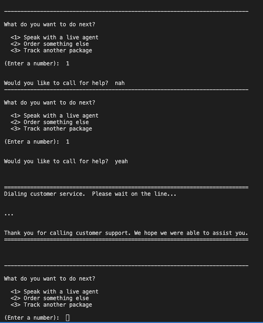

# Overview
This project is a simple Python command-line chatbot that helps users locate, track, and manage their online orders.
It aims to simulate a package tracking assistant that guides users step-by-step through the process.

<br>

# Setup/installation

1.) Clone the repository: 
```bash
git clone https://github.com/juji-lau/package_tracker.git
cd package_tracker
```

2.) Make sure you have **Python 3.10+** installed:
- Check your version:
  ```bash
  python --version
  ```
- If you need to install it [Download Python here](https://www.python.org/downloads/)


3.) Run the program:
```bash 
python chatbot.py
```
<br>

# Approach
My goal was to create a simple, engaging chatbot agent that users will feel like they are talking to a real person when interacting with.  This chatbot guides users to find and track orders, cancel them if needed, and offers to connect to a live agent when needed.

## User Interaction
- Users can search by tracking number or by email + product info.  
- Commands like `help` connect to a live agent, while `exit` or `quit` end the session.  
- Messages are written to sound friendly and human, as if the chatbot were a real support agent.  

## Design
- The `Item` class models an order.
- `database.py` creates a mock order database.
- `chatbot.py` contains chatbot functions for:
  - Greeting the user
  - Prompting and parsing input
  - Locating orders
  - Displaying/cancelling orders
  - Offering next steps (re-order, tracking another, connect to agent, etc.)
  - Exiting cleanly


## Error Handling
- Invalid inputs are first reparsed, then escalated to a live agent if needed.  
- Variations of yes/no are accepted (e.g. "yeah", "nah").
- If a package cannot be found, the chatbot offers to connect to a live agent.

<br>

# Examples: 
My program includes but are not limited to the following examples:

<br>

## Features:

**(1) Finding an order by ID number:**
<p align="center">
  
</p>

***
<br>

**(2) Finding an order by email and product info:**
<p align="center">
  
</p>

***
<br>

**(3) Cancelling an order:**
<p align="center">
  
</p>

***
<br>

**(4) Calling for Help:**
<p align="center">
  
</p>

<br>
<br>

## Error Handling:
<br>

**(1) Repeated invalid email addresses**
<p align="center">
  
</p>

***
<br>

**(2) Invalid core choice input**
<p align="center">
  
</p>
